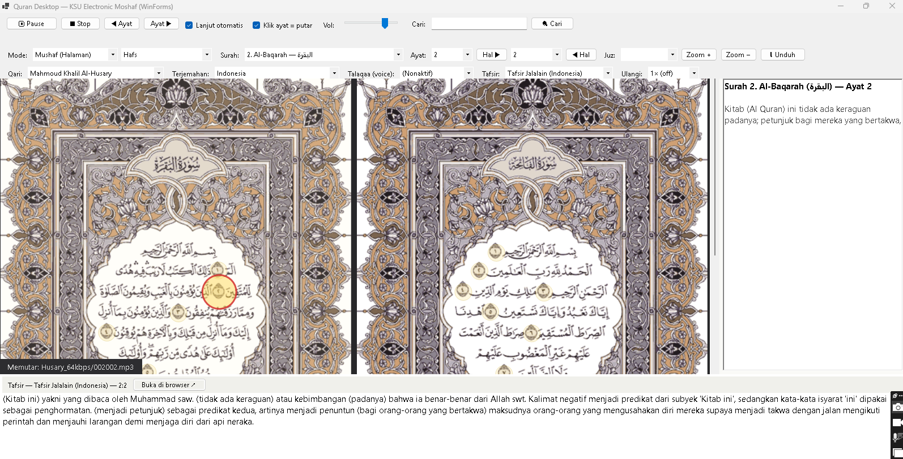

# Quran Desktop — KSU Electronic Moshaf untuk Windows

Aplikasi Al-Qur'an desktop (Windows Forms / C# .NET 7) yang dibuat ulang berdasarkan situs resmi
**[Quran KSU Electronic Moshaf Project](https://quran.ksu.edu.sa/index.php?ui=1&l=en)** — Universitas King Saud, Arab Saudi.

> Dibuat ulang untuk **Windows 10 & 11** oleh **Lindu Cipta Pranayama**
> Dibangun menggunakan **GLM 5.3 Flash**
> Kontak / WhatsApp: **0812-9605-2010** (+62 812 9605 2010)

---

## Download

**Portable (tidak perlu install):** [Google Drive — QuranDesktop portable](https://drive.google.com/drive/folders/1A0AvGWNaHMU2bZtrvoES25RUh-pr6VMx?usp=sharing)

Alternatif: [GitHub Releases](https://github.com/linducip2208/alquran/releases) — unduh `QuranDesktop-v1.0.0-win-x64.exe`, jalankan langsung di Windows 10/11 (tanpa install .NET).

---

## Tampilan



---

## Fitur

| Fitur | Keterangan |
|---|---|
| 3 Mode Tampilan | **Mushaf** (buka-bukaan 2 halaman, ganjil kanan–genap kiri), **Teks & Terjemahan**, **Tes Hafalan (Hifz)** |
| 3 Jenis Mushaf | Hafs, Rewayat Warsh, Hafs Tajweed (604 halaman, gambar asli server KSU) |
| Klik Ayat di Mushaf | Klik langsung ayat pada halaman → highlight + arti + tafsir |
| 43 Qari | Hafs lengkap + varian Warsh, Murattal/Mujawwad/Teacher (Husary, Abdul Basit, Minshawi, Sudais, Maher, Afasy, dll.) |
| 22 Terjemahan | Indonesia, English (Saheeh International), Melayu, Arab (4 varian), Urdu, Rusia, dll. |
| 9 Kitab Tafsir | **Tafsir Jalalain (Indonesia)**, Al-Muyassar, Ibn Kathir, As-Sa'dy, Al-Baghawy, Al-Qortoby, At-Tabary, I'rab, Tafhim (Rusia) |
| Talaqaa (Voice Translation) | Audio terjemahan: English, French, Urdu, Bosnian |
| Pemutar Audio | Per-ayat, auto-next antar ayat & surah, repeat 1×–10×/∞, basmalah & audhubillah otomatis, volume |
| Navigasi Lengkap | Surah, Ayat, Halaman, Juz — seperti situs aslinya |
| Pencarian | Cari kata/frasa di seluruh Al-Qur'an → langsung lompat ke ayat |
| Mode Hifz | Soal hafalan acak dari rentang surah/ayat, sembunyi/tampil teks, putar audio |
| Indikator Sajdah | Ayat sajdah wajib / disunnahkan di status bar |
| Unduh Massal | Download semua/rentang halaman mushaf untuk baca offline |
| Shortcut Keyboard | ← → pindah ayat • Space play/pause • PgUp/PgDn halaman • Ctrl+F cari |
| Cache Offline | Audio, gambar mushaf, terjemahan & tafsir tersimpan otomatis |
| Simpan Posisi | Surah, ayat, qari, mode, zoom — tersimpan otomatis |

## Sumber Data — semua dari situs resmi KSU

Semua konten di aplikasi ini diambil langsung dari server **[quran.ksu.edu.sa](https://quran.ksu.edu.sa)** (Electronic Moshaf Project, King Saud University). Endpoint yang digunakan:

**Audio (Talaqah per-ayat):**

| Konten | Endpoint |
|---|---|
| Audio ayat per qari | `https://quran.ksu.edu.sa/ayat/mp3/{qari}/{SSS}{AAA}.mp3` — contoh: `ayat/mp3/Husary_64kbps/056018.mp3` |
| Audhubillah (intro) | `https://quran.ksu.edu.sa/ayat/mp3/all/audhubillah.mp3` |
| Basmalah per qari | `https://quran.ksu.edu.sa/ayat/mp3/{qari}/001001.mp3` |
| Voice translation | folder `English_Walk`, `fr.leclerc_128kbs`, `ur.khan_46kbs`, `Bosnian_Korkut_128kbps` |

**Gambar mushaf (604 halaman):**

| Mushaf | Endpoint |
|---|---|
| Hafs | `https://quran.ksu.edu.sa/ayat/safahat1/{halaman}.png` |
| Rewayat Warsh | `https://quran.ksu.edu.sa/warsh/{halaman}.png` |
| Hafs Tajweed | `https://quran.ksu.edu.sa/tajweed_png/{halaman}.png` |

**Teks, tafsir, terjemahan, pencarian** — via `https://quran.ksu.edu.sa/interface.php?ui=pc`:

| Konten | Endpoint |
|---|---|
| Tafsir per-ayat | `&do=tafsir&author={kitab}&sura={s}&aya={a}` |
| Terjemahan (rentang) | `&do=tarjama&tafsir={kode}&b_sura=…&b_aya=…&e_sura=…&e_aya=…` |
| Pencarian ayat | `&do=search` (POST `query`) |
| Koordinat highlight ayat di mushaf | `&do=hilites&page={halaman}` |

**Daftar kitab tafsir** (key `author`): `indonesian` (Jalalain — Indonesia), `muyassar`, `sa3dy`, `baghawy`, `katheer`, `qortoby`, `tabary`, `e3rab`, `russian` (Tafhim — Rusia)

**Kode terjemahan** (key `tafsir` pada tarjama): `id_indonesian` (Indonesia), `en_sh` (English — Saheeh International), `ms_basmeih` (Melayu), `ar_ayat`/`ar_ayat_safy`/`ar_mu`/`ar_ma3any` (Arab), `ur_gl` (Urdu), `ru_ku` (Rusia), `fr_ha`, `es_navio`, `de_bo`, `it_piccardo`, `pt_elhayek`, `nl_siregar`, `bs_korkut`, `sq_nahi`, `sv_bernstrom`, `tr_diyanet`, `ku_asan`, `pr_tagi`, `ml_abdulhameed`

**Metadata halaman, juz & sajdah:**
- `https://quran.ksu.edu.sa/js/quran-data.js` — pemetaan halaman (Page/Page_warsh/Page2), juz, dan daftar ayat sajdah; sumber aslinya metadata **[Tanzil.net](https://tanzil.net)** (lisensi GPL), digunakan oleh situs KSU

**Peta konfigurasi** (daftar 43 qari, jenis mushaf, kode terjemahan) diekstrak dari script situs: `https://quran.ksu.edu.sa/provider/index.php?g=scr`

**Tautan tafsir versi web** (tombol "Buka di browser"): `https://quran.ksu.edu.sa/tafseer/{kitab}/sura{s}-aya{a}.html`

## Menjalankan

**Cara termudah — exe portable (tidak perlu install apa pun):**

Unduh dari [Google Drive](https://drive.google.com/drive/folders/1A0AvGWNaHMU2bZtrvoES25RUh-pr6VMx?usp=sharing) atau [GitHub Releases](https://github.com/linducip2208/alquran/releases), lalu jalankan `QuranDesktop.exe`.

**Dari source code:**

1. Install [.NET 7 SDK](https://dotnet.microsoft.com/download/dotnet/7.0)
2. `dotnet build QuranDesktop -c Release`
3. `dotnet run --project QuranDesktop`

> Koneksi internet diperlukan saat pertama membuka konten; setelah tersimpan di cache, dapat diakses offline.

## Struktur Project

```
QuranDesktop/
├── Controls/          MushafView, TextModeControl, HifzControl, SearchDialog, DownloadDialog
├── Data/quran-data.js Metadata halaman & juz (Tanzil, embedded resource)
├── MainForm.cs        Orkestrasi UI & pemutar audio (MCI/winmm — tanpa dependency)
├── KsuApi.cs          Klien API tafsir/terjemahan/pencarian/koordinat KSU
├── QuranData.cs       Parser metadata halaman, juz, sajdah
└── Reciters.cs, Translations.cs, Tafsirs.cs, MushafTypes.cs
```

## Kredit

- **Sumber & data:** [Quran KSU Electronic Moshaf Project](https://quran.ksu.edu.sa) — Electronic Moshaf Project, King Saud University
- **Metadata Quran:** [Tanzil.net](https://tanzil.net) (GPL)
- **Dibuat ulang untuk Windows 10 & 11:** Lindu Cipta Pranayama (WA 0812-9605-2010)
- **Dibangun dengan:** GLM 5.3 Flash
